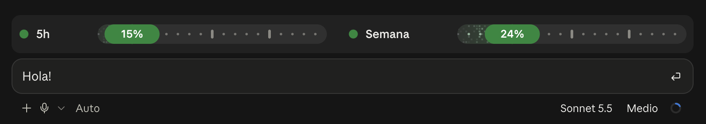

# usage-bars

Un mod para Claude Code que muestra sobre el prompt cuánto te queda de tus límites de uso: la ventana de **5 horas** y la **semanal**, lado a lado.



- Una barra de píxeles por límite, con los píxeles titilando y más densos hacia la cabeza.
- Marcas cada 5 % y cápsulas cada 25 %, que se iluminan al superarlas.
- Una píldora en la cabeza de la barra que alterna cada pocos segundos entre el **porcentaje usado** y el **tiempo que falta para el reinicio**.
- Colores: verde bajo el 80 %, naranjo desde el 80 % y rojo al llegar al límite.
- Cuando el uso cambia, el relleno se desliza hasta su nueva posición en lugar de saltar.
- En la terminal se ve una versión de texto simple; el estilo de píxeles es de la app de escritorio.

## Instalación

En Claude Code:

```
/plugin marketplace add AxelDreemurr/UsageBars
/plugin install usage-bars@axel-mods
```

O copia `plugins/usage-bars` a `~/.claude/skills/usage-bars` para cargarlo en todas las sesiones.

## Requisitos y límites

- Los datos de los límites los entrega Claude Code solo en **cuentas de suscripción** (Pro, Max...). Con una API key no hay límites que mostrar y verás "esperando datos".
- Las barras se actualizan con cada respuesta de Claude, no en tiempo real. Antes de la primera respuesta de la sesión puede aparecer "esperando datos".
- Usa la API de mods de Claude Code (hooks de función). Si tu versión no la tiene, el mod no se carga.

## Cómo funciona

El mod escucha `session.measure`, que el motor lanza cuando un límite avanza un punto entero, y guarda las ventanas (`five_hour`, `seven_day`) en el estado de la sesión. Un hook de `ui.render` sobre el prompt dibuja una barra SVG por ventana. El titileo y la alternancia de la píldora son animaciones dentro del propio SVG, así que no hace falta redibujar por temporizador. Solo se redibuja cuando cambia el uso y una vez por minuto para refrescar el tiempo de reinicio.

## Créditos

El estilo visual (barra de píxeles, marcas, píldora) está inspirado en [plan-progress](https://github.com/zycck/claude-mods) de zycck. El código de este mod es propio.

## Licencia

MIT
